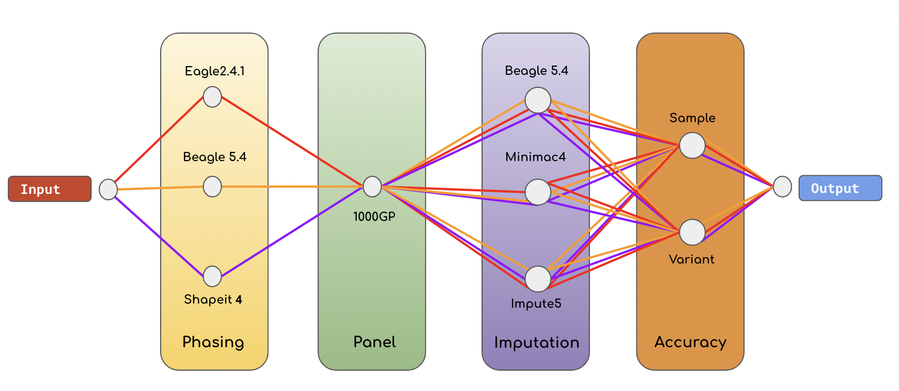

# A comparative analysis of current Phasing and Imputation software


### Source Code




## Usage:

The help shows all the required arguments listed above, plus optional arguments.

```
Usage: ./Imputation_score.sh -i <input.vcf.gz> -r <ref_file> -t <4> -o <output_name> -c <20>
Use -h or --help to display help.

author: SELFDECODE
contact email : adriano@selfdecode.com

SelfDecode pipeline to analyze multiple phasing and imputation softwares simultaneously 

Parameters:

      -h|--help
              show help
      -i|--input
              input file
      -r|--reference
              full path reference file without extension.
      -t|--threads
              number of cpus to use.
      -o|--output
              output prefix. No extension.
      -c|--chr
              chomosome to analyze allowed [1-22 X]. NO chr prefix.
      -ibeagle|--imp_beagle
              skip Beagle imputation
      -pbeagle|--phase_beagle
              skip Beagle haplotype estimation
      -impute5|--impute5
              skip Impute imputation
      -shapeit|--shapeit
              skip ShapeIT Phasing
      --minimac|--minimac
              skip Minimac imputation
      -eagle|--eagle
              skip Eagle phasing
      -bigref|--BIGREF
              use this option if you get memory allocate error during accuracy evaluation

[base] Usage: ./Imputation_score.sh -i <input.vcf.gz> -r <ref_file> -t <4> -o <output_name> -c <20>
[skip] Usage: ./Imputation_score.sh -i <input.vcf.gz> -r <ref_file> -t <4> -o <output_name> -c <20> -ibeagle no -impute5 no
[memo] Usage: ./Imputation_score.sh -i <input.vcf.gz> -r <ref_file> -t <4> -o <output_name> -c <20> -bigref yes
```

## Before running the example - change paths for software 
```
#SOFTWARE PATH (EDITABLE PART)
time="/usr/bin/time -f"
repo="/home/ec2-user/adriano/imputation/phase2/software"
eagle2="${repo}/eagle2.4.1/Eagle_v2.4.1/eagle"
shapeit4="${repo}/shapeit4/shapeit4-4.2.1/bin/shapeit4.2"
beagle5="java -Xmx8g -jar ${repo}/beagle5.2/beagle.29May21.d6d.jar"
bref3="java -Xmx8g -jar ${repo}/beagle5.2/bref3.29May21.d6d.jar"
imp5Converter="${repo}/impute5/impute5_v1.1.5/imp5Converter_1.1.5_static"
miniConverter="${repo}/Minimac3Executable/bin/Minimac3"
impute5="${repo}/impute5/impute5_v1.1.5/impute5_1.1.5_static"
minimac4="${repo}/minimac4/Minimac4/build/minimac4"
simpy="/home/ec2-user/adriano/git/rd-imputation-accuracy/bin/Simpy.py"
imputation_accuracy="/home/ec2-user/adriano/git/rd-imputation-accuracy/bin/imputation_accuracy.sh"
#GENETIC RECOMBINATIO MAP PATH
map_eagle2="${repo}/eagle2.4.1/Eagle_v2.4.1/tables/genetic_map_hg38_withX.txt.gz"
map_beagle5="/home/ec2-user/adriano/imputation/phase2/genetic_map/plink.chr${CHROMOSOME}.chr.GRCh38.map"
map_shapeit4="/home/ec2-user/adriano/imputation/phase2/genetic_map/chr${CHROMOSOME}.b38.gmap.gz"
map_impute5=$map_shapeit4
#WGS PATH for accuracy
wgs_subset_chr="/home/ec2-user/adriano/imputation/phase2/reference_panel/ref_30x/chr20.reference_panel.30x.hg38.190samples.vcf.gz"
wgs_subset="/home/ec2-user/adriano/imputation/phase2/reference_panel/ref_30x/20.reference_panel.30x.hg38.190samples.vcf.gz"
bwgs_subset_chr="/home/ec2-user/adriano/imputation/phase2/reference_panel/ref_30x/chr20.reference_panel.30x.hg38.190samples.bcf.gz"
bwgs_subset="/home/ec2-user/adriano/imputation/phase2/reference_panel/ref_30x/20.reference_panel.30x.hg38.190samples.bcf.gz"
```

## How to run example:
```
./Imputation_score.sh -i data/HG00096_example_chip_data.vcf.gz -r reference/reference_panel_example_3samples.vcf.gz -t 4 -o chip_example -c 20
```

# Accuracy

## Pre-requisite 
```
bcftools
pandas
numpy
cyvcf2
```
## Required command line arguments are:

The following inputs, in vcf.gz format, including its respective tabix .tbi file, are required to run.

- imputed: imputation results
- wgs: ground truth file, containing experimentally determined genotypes (i.e. Whole Genome Sequencing data)
- bwgs: same wgs file but in BCF format to speed up the process and .csi index file associated.

***N.B. The Imputation_score.sh is designed to run automatically from phaing to accuracy evaluation, but in case you will need to run accuracy directly on some VCFs file you can use the following section.***

## How to run Accuracy evaluation:
```
./bin/imputation_accuracy.sh -i <imputed_phasing_imputation_CombinationSoftware.vcf.gz> -w WGS.vcf.gz -bw WGS.bcf.gz -t 4
```

This will create multiple chunks of the VCF imputed in input and analyze each one with the Simpy.py software and at the end will use the rebuild_metrics.py script to re-calculate the results. 

This message will show up if everything worked:

```
Imputed VCF   : imputed_HG00479.vcf.gz
WGS VCF       : wgs_HG00479.vcf.gz
WGS BCF       : wgs_HG00479.bcf.gz
Threads       : 4
Skip chunks   : False
Skip analysis : False
Splitted Imputed file in chuncks of [100k]
BCF Imputed files Created
Joining files...
Deleting tmp files...
Process Completed.
${sample_name}_per_sample_results.tsv.gz
${sample_name}_per_variant_results.tsv.gz"
```

## References:
[Paper-biorxiv: Adriano De Marino, Abdallah Amr Mahmoud, Madhuchanda Bose, Karatuğ Ozan Bircan, Andrew Terpolovsky, Varuna Bamunusinghe, Umar Khan, Biljana Novković, Puya G. Yazdi](https://www.biorxiv.org/content/biorxiv/early/2021/11/04/2021.11.04.467340.full.pdf)
